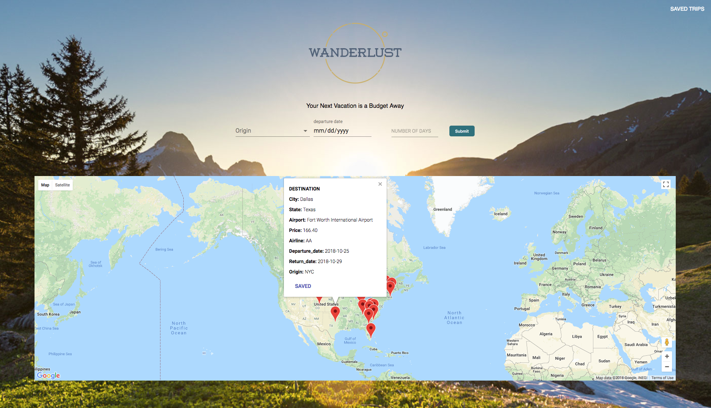

# Wanderlust

Search for the cheapest flights based on origin city, date and trip duration.

Live demo [_here_](https://destination-finder.herokuapp.com/)

> Since it is hosted on heroku the initial load time may lag. Currently there are issues connecting to MongoDB atlas so trips at the moment can't be saved. Previous working database was connected to mLab. There have been changes to the API so the search function may not return results on every destination anymore.

## Description

- Create-React-App that connects to a NodeJS and Express backend. Communicates data from Mongo Atlas database.
- Uses Amadeus api to find flight results.
- Received data gets plotted on google maps with details of flight.
- There is an option to save flight to a saved trips page with all the flight details

## Technologies Used

- React
- Redux
- MongodDB
- NodeJS
- ExpressJS
- Material-UI

## Features

- Material UI form with error handling. Submits a request to Amadeus API for flight information.
- Google Maps plots flight data.
- Flights can be saved to saved flights page.

## Landing page with form and google map



## 🛠️ Installation Steps

Install dependencies

```bash
npm install
```

Use node version 9.7.1

```bash
nvm use 9.7.1
```

### Executing program

Running the following script runs several other scripts: "concurrently \"npm run client\" \"npm run server\"",

```
npm run dev
```

## Contact

Created by [@cfrancisco726](http://www.carlofrancisco.com) - feel free to contact me!
